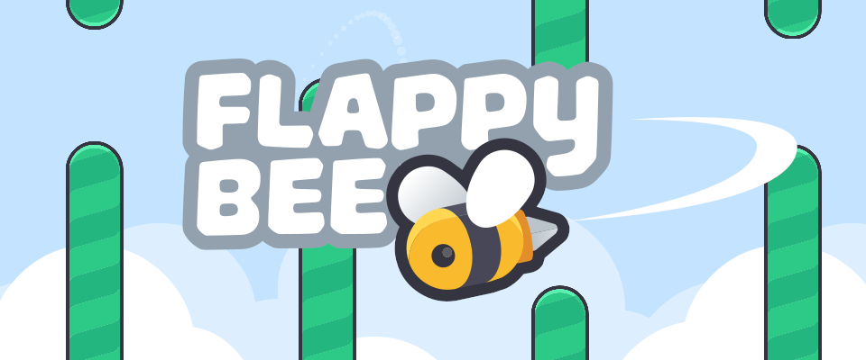
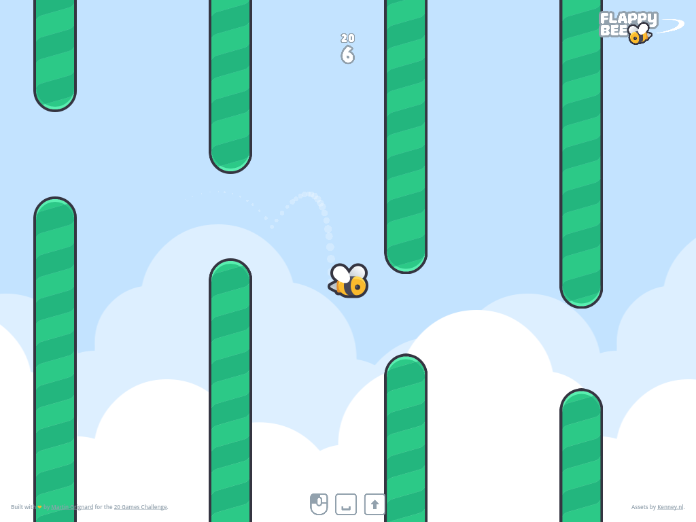

> A bee's first flight! 🐝

In *Flappy Bee*, you control a bee that has to navigate between the longest series of obstacle possible.
Straighten your antennae, polish your wings and take off on your first flight!

## Context

This game is my first ever game created with the [Godot Engine][godot-engine].
It is my first entry to the [20 Games Challenge][20-games-challenge].

___

_Built with_ ❤️ _by [Martin Grignard][martin-grignard] for the [20 Games Challenge][20-games-challenge]._  
_Assets by [Kenney.nl][kenney]._

<!-- References -->
[20-games-challenge]: https://20_games_challenge.gitlab.io
[flappy-bird]: https://20_games_challenge.gitlab.io/games/flappy
[godot-engine]: https://godotengine.org
[kenney]: https://kenney.nl
[martin-grignard]: https://github.com/MartinGrignard
